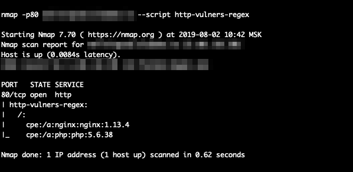

# nmap_vulner

## Description

Le script NSE utilise des informations sur les services connus pour fournir des données sur les vulnérabilités. Notez qu'il est déjà inclus dans la bibliothèque standard nmap NSE.

## Dependances:
    nmap libraries:
        http
        json
        string
    http-vulners-regex

Gardez à l'esprit que le script dépend de la disponibilité d'informations sur les versions du logiciel, il ne fonctionne donc qu'avec l'indicateur -sV.

**NB:** Désormais, il peut être exécuté sans l'indicateur -sV si le script http-vulners-regex est également exécuté.

## Installation
    localiser où se trouvent vos scripts nmap sur votre système
         pour le système *nix, il peut s'agir de ~/.nmap/scripts/ ou $NMAPDIR
         pour Mac, cela pourrait être /usr/local/Cellar/nmap/<version>/share/nmap/scripts/
         pour Windows, il peut s'agir de C:\Program Files (x86)\Nmap\scripts
     copiez le script fourni (vulners.nse) dans ce répertoire
     exécutez *nmap --script-updatedb* pour mettre à jour la base de données de script nmap

## Usage
  Utilisez-le aussi simplement que possible :
         nmap -sV --script vulners [--script-args mincvss=<val_arg>] <cible>

# http-vulners-regex

## Description

Le script NSE analyse les réponses HTTP et identifie les CPE pour le logiciel mentionné. Il peut donc augmenter l'efficacité du script principal des vulnérabilités.

Ou avec les chemins :

## Dependances
    nmap libraries:
        http
        json
        string
        stdnse
        shortport
        table

## Installation
   localiser où se trouve nmap sur votre système
         pour le système *nix, cela peut être ~/.nmap/ ou $NMAPDIR
         pour Mac, cela pourrait être /usr/local/Cellar/nmap/<version>/share/nmap/
         pour Windows, il peut s'agir de C:\Program Files (x86)\Nmap\
     copiez le script fourni (http-vulners-regex.nse) dans <nmap_dir>/scripts/
     copiez le json fourni avec les regex dans <nmap_dir>/nselib/data/
     copiez le fichier txt fourni avec les chemins par défaut vers <nmap_dir>/nselib/data/
         notez que vous pouvez spécifier votre propre fichier via la ligne de commande
     exécutez *nmap --script-updatedb* pour mettre à jour la base de données de script nmap

## Usage
    Comme un script NSE habituel :
         nmap --script http-vulners-regex.nse [--script-args paths={"/"}] <cible>

# vulners_enterprise

## Description 
Il s'agit essentiellement des bons vieux fidèles nmap-vulners d'en haut, à une exception près : il nécessite une API_KEY pour fonctionner.

Vous pouvez soit le spécifier sur la CLI à l'aide de l'argument de script 'api_key', le définir dans une variable d'environnement VULNERS_API_KEY ou le stocker dans un fichier lisible par l'utilisateur exécutant nmap. Dans ce cas, vous devez spécifier le chemin absolu vers le fichier à l'aide de l'argument de script 'api_key_file'.
#
# Usage
   Comme un script NSE habituel :
         nmap -sV --script vulners_enterprise [--script-args mincvss=<arg_val>,api_key=<api_key>,api_key_file=<absolute_path>,api_host=http://my_host.com] <target>
         
### NSE Arguments

**vulners_enterprise.mincvss** Limitez les CVE affichés à ceux qui ont ce score CVSS ou plus.

**vulners_enterprise.api_key** API Token à utiliser dans les requêtes

**vulners_enterprise.api_key_file** Achemin absolu vers le fichier avec une seule ligne contenant le token API

**vulners_enterprise.api_host** URL vers l'API des vulnérabilités sans le slash initial. Par défaut, https://vulners.com

